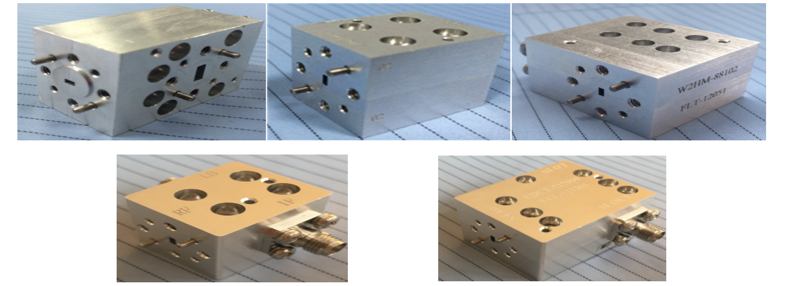
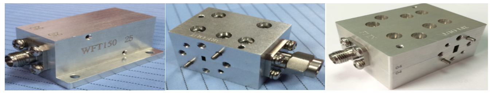
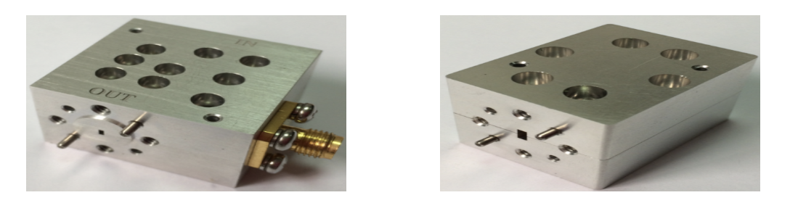
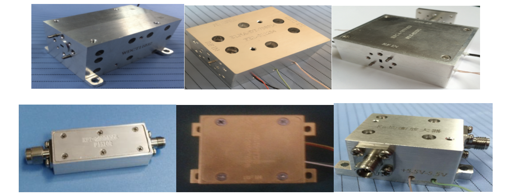

## 研究方向

### 方向一：太赫兹的激发(王浩洋博士生负责)
太赫兹波位于微波与红外线之间，是电磁波谱上待开发的最后一个波段。美国麻省理工学院曾将太赫兹技术评为“改变未来世界的十大技术”之一。太赫兹辐射创新实验室致力于研发高效宽谱太赫兹源，分析辐射机理，优化辐射性能，为太赫兹技术的推广与应用提供技术保障。
团队依托重量级国家自然科学基金项目，恒温恒湿千级洁净间内百万光学研究设备全部到位；与北京超级云计算中心展开深度合作，坐拥海量计算资源；与罗切斯特大学张希成教授、伊利诺伊理工大学Thomas Wong教授建立密切交流合作关系，并与Thomas Wong教授联合发表论文多篇；每年参加国际顶级学术会议两次以上，多次口头报告及墙报展示。  
近期代表作：  
[1] Wang, H., and T. Shen. "Unified theoretical model for both one-and two-color laser excitation of terahertz waves from a liquid" Applied Physics Letters 117.13(2020):131101.  
[2] Haoyang Wang, Tao Shen*, Zezhong Tian. Ponderomotive Force Analysis of Terahertz Generation in Liquid Water, 2020 45th International Conference on Infrared, Millimeter, and Terahertz Waves (IRMMW-THz).  
[3] Jiarong Zhang, Tao Shen*, Haoyang Wang, Jiahe Liu. The Control of Terahertz Radiation Excited by Three-Color Laser Pulses via Phase Difference and Intensity Ratio, 2021 43rd International Conference on Photonics and Electromagnetics Research Symposium (PIERS).  
太赫兹技术是多学科交叉融合前沿领域。我们致力于打造多学科合作研究小组，涵盖物理、电子、光学、控制、材料、化学等专业。

邮箱：iltr626@163.com / shentao@kust.edu.cn （附简历，并标注“太赫兹课题组”）
联系人：刘佳和15758138669
地点：信自楼626/121

### 方向二：硬件研发(窦江玲老师负责)
研究生毕业后的你能：
熟练使用HFSS电磁仿真软件完成微波及毫米波电路的三维电磁模型设计以及电磁兼容等分析计算；
熟练使用ADS专业仿真软件完成微波电路的设计工作；
熟练使用CAD画图软件完成电路设计以及工程制图；
能够独立完成了多个项目的设计、建模、仿真、焊接、调试等主要工作。
本课题组已成功研制了K波段到G波段的混频器、倍频器、放大器、均衡器、滤波器、功分器、耦合器等器件。相比于同类产品，上述研发器件中的倍频和混频器件带宽更宽，成本相对较低，实用性更强、应用性更广；研制出的腔体滤波器带外抑制度相对较高、耦合器设计方法较为先进，所研制的相关产品在国内外受到了高度认可。
研发的项目主要包括：机箱电磁耦合、S波段多路多波束收发系统、Ka波段收发前端系统、车载FOD监测雷达系统、W波段测云雷达前端系统、W波段FMCW收发前端系统、D波段收发前端系统、太赫兹混频等，其中W波段FMCW收发前端系统应用在中电第38所安检设备中，是国内首套在反暴恐一线投入实际使用的太赫兹安检仪器；另外车载FOD监测雷达系统应用在上海航空测控技术研究所的产品中，在机场安检、异物排除中发挥了巨大的作用。

下面是课题组研发的部分模块照片

混频器系列

倍频器系列

攻放系列

## 咨询
### 加入QQ群来咨询吧[推荐！]
QQ群号: 338500152

