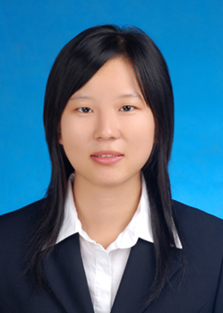
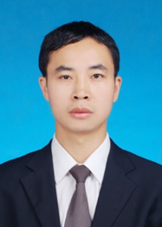

# 导师介绍

## 沈韬

---

  

    <h2>简介</h2>
    

    博士，教授，博师生导师，昆明理工大学信息工程与自动化学院院长。云南省中青年学术技术带头人后备人才、云南省“万人计划”青年拔尖人才、云南省引进高层次人才。主持和参与国家自然科学基金项目、国家重大科学仪器设备开发专项、云南省应用基础研究项目、云南省教育厅基金以及企业合作横向科研项目等20余项。发表SCI、EI收录论文50余篇，出版学术专著2本，授权发明专利5项。主要研究方向：智能感知与计算、人工智能与数据挖掘、区块链与工业互联网等。
    

  

  

    
  

--- 

### 教育经历
1. 2008/8–2013/5， 美国伊利诺伊理工大学，电子工程，博士   
2. 2006/8–2008/5， 美国伊利诺伊理工大学，电子工程，硕士   
3. 2002/9–2006/7， 电子科技大学，电子信息工程，学士  

---

### 科研与学术工作经历  

1. 2016/6至今，昆明理工大学，信息工程与自动化学院，副院长  
2. 2014/8-2016/6 昆明理工大学，材料科学与工程学院，教授  
云南省新材料制备与加工重点实验室，副主任  
3. 2012/8-2014/8，昆明理工大学，材料科学与工程，讲师  
4. 2011/8-2012/5，伊利诺伊理工大学，电气与计算机工程系，讲师

--- 

### 主持或参加科研项目（课题）及人才计划项目情况

1. 云南省稀贵金属材料基因工程（一期 2020）-云南省稀贵金属知识产权与标准信息平台建设及数据可信共享关键技术开发与应用.2020.1-2022.12 ，300万元，在研，主持。  
2. 低维液态结构太赫兹波激发与原位增强研究，2020.1~2023.12，62万元，在研，主持。  
3. 基于区块链技术的云南省数字经济可信生态体系发展战略咨询研究.2020.8-2021.7，100万元，在研，主持。  
4. 支撑区域综合能源交易的区块链服务平台研发及应用。2019.12-2020.12，59万元，在研，主持。  
5. 国家自然科学基金面上项目、61671225、基于太赫兹光谱数据库的光谱识别检索与分析方法研究、2017/1-2020/12、60万元、在研、主持。  
6. 云南省科技厅重大项目、201451004、碳纳米管增强金属基复合材料应用基础研究、2014/10-2017/10、100万、在研、参与。  
7. 云南省教育厅重大专项、KKJZX201651002、先进碳纳米管增强铜基复合材料的关键制备技术与应用研究、2016/09-2019/10、150万、在研、参与。  
8. 国家自然科学基金青年项目、61302042、硅纳米微粒阵列太赫兹电磁特性及等效电路模型研究、2014/1-2016/12、28万、结题、主持。  
9. 云南省应用基础研究青年项目、2013FD010、基于载流子输运分析的硅纳米簇太赫兹电磁特性研究、2013/10-2016/9、6万、结题、主持。  
10. 昆明理工大学重点学科建设项目，14078235，2013/1-2017/12，375万元，在研，主持  
11. 昆明理工大学校人陪基金，KKZ3201451015，太赫兹材料指纹识别技术研究，2014/06/15-2016/05/15，3万元，结题，主持。  
12. 云南省引进高层次人才，2013年

--- 

### 代表性研究成果和学术奖励情况

一、期刊论文  
1.	Cai, Wenjun & Jiang, Wei & Xie, Ke & Zhu, Yan & Liu, Yingli & Shen, Tao. (2020). Dynamic reputation–based consensus mechanism: Real-time transactions for energy blockchain. International Journal of Distributed Sensor Networks. 16. 155014772090733. 10.1177/1550147720907335.  
2. 虞浩跃, 沈韬, 朱艳, et al. 基于双向长短期记忆网络的太赫兹光谱识别[J]. 光谱学与光谱分析, 2019, 39(12).  
3. Zhu Y, Chen YQ, Shen T*, et al. Direct current magnetron sputtered Cu2ZnSnS4 thin films using a ceramic quaternary target. JOURNAL OF ALLOYS AND COMPOUNDS. 2017, 727:1115-1125.  
4. Tao Shen, Yong Liu, Yan Zhu, De-Quan Yang, Edward Sacher; Improved adhesion of Ag NPs to the polyethylene terephthalate surface via atmospheric plasma treatment and surface functionalization; Applied Surface Science; 2017, 411, 411–418.  
5. Ni JP, Shen T*, Zhu Y, et al. Terahertz Spectroscopic Identification with Diffusion Maps. SPECTROSCOPY AND SPECTRAL ANALYSIS. 2017. 37:2360-2364.  
6. Liu XQ, Li CJ, Shen T, et al. Microstructure evolution and mechanical properties of carbon nanotubes reinforced Al matrix composites. MATERIALS CHARACTERI-ZATION. 2017, 133:122-132.  
7. Guo BS, Song M, Shen T, et al. Improving the mechanical properties of carbon nanotubes reinforced pure aluminum matrix composites by achieving non-equilibrium interface. MATERIALS & DESIGN. 2017. 120:56-65.  
8. Wang L, Yang JY, Shen T, et al. An environment-friendly fabrication of superhydrophobic surfaces on steel and magnesium alloy. MATERIALS LETTERS. 2016:297-299.  
9. Zhong Y, Shen T*, Mao C, et al. Terahertz Spectrum Features Extraction Based on Kernel Optimization Relevance Vector Machine. Spectroscopy and Spectral Analysis, 2016, 36 (12): 6.  
10. Hongmei Qing, Yan Zhu, Tao Shen*; A facile two-step-heating route to synthesize hierarchical metastable wurtzite Cu2ZnSnS4 microcrystals under the open-air condition; Materials Letters; 2016, 176, 177-180.  
11. Hu, Y.M.，Zhu, Y，Shen, T.et al，Dip-coating for dodecylphosphonic acid derivatization on aluminum surfaces: an easy approach to superhydrophobicity，JCT Research，2016，13（1）：115-121。  
12. Shen Tao, Chen Yiqi, Zhu Yan, et al. Progress in Preparation of Cu2ZnSnS4 Thin Film by Magnetron Sputtering. Materials Review, 2016, 30:14-20.  
13. Hu, Wen，Shen, Tao，Hou, Hongying，et al，Collagen-biomorphic porous carbon nanofiber monoliths: Biosilicification-assisted sustainable synthesis and application in Li-S battery，Functional Materials Letters，2016，9（1）。  
14. Yi Jianhong, Yang Ping, Shen Tao*. Research progress of electrical properties for carbon nanotubes reinforced metal matrix composites. Acta Materiae Compositae Sinica. 2016, 33:689-703.   
15. Ma Shuai，Shen Tao*，Wang Rui-qi，Lai Hua，Yu Zheng-tao，Terahertz Spectroscopic Identification with Deep Belief Network，Spectroscopy and Spectral Analysis，2015，35（12）：3325-3329。
16. Yi, Jian-Hong，Bao, Rui，Li, Cai-Ju，Shen, Tao*，et al，Research progress of CNTs reinforced Cu/Al matrix composites，Chinese Journal of Nonferrous Metals，2015，25（5）：1209-1219。
17. Wang Rui-qi，Shen Tao*，Ma Shuai，Guo Jian-yi，Yu Zheng-tao，Classification of THz Transmission Spectrum Based on Kevnel Function of Convex Combination，Spectroscopy and Spectral Analysis，2015，35（5）：1187-1192。
18. Du, Wangli，Shao, Hong，Shen, Tao，et al，Cross-Linking Poly(lactic acid) Film Surface by Neutral Hyperthermal Hydrogen Molecule Bombardment，Journal of Agricultural and Food Chemistry，2015，63（49）：10604-10610。
19. Shen, T.，Hu, Z.，Wong, T.，Transport-based equivalent circuit for semiconductor nanoparticle in terahertz frequency range，Electronics Letters，2013，49（1）：52-53。
20. Shen, Tao，Yan, Ming，Wong, Thomas T. Y.，Charge Polarization and Current Distribution in a Conductive Particle in the Rayleigh Region，IEEE Transactions on Antennas and Propagation，2013，61（8）：4229-4238。

二、专著
1. 易健宏，沈韬，等，碳纳米管增强金属基复合材料，科学出版社，2017。
2. Tao Shen，Response of Semiconductor Nanostructures to a Terahertz Electric

三、授权发明专利  
1. 甘国友, 沈韬, 朱艳,一种纤锌矿Cu2ZnSnS4纳米晶的大规模制备方法,201610821814.0
2. 沈韬, 朱艳, 孙淑红,一种纤锌矿CMTS纳米晶的制备方法，201711380289.4
3. 沈韬, 朱艳, 孙淑红,一种基于磁控溅射法的CZTS叠合吸收层及其制备方法，201711306144.X
4. 朱艳, 黎振华, 沈韬,一种二氧化硅纳米线的制备方法，201610596942.X
5. 李才巨, 易健宏, 沈韬,等，一种碳纳米管增强铝基多层复合材料的制备方法 201610115738.1 
6. 沈韬, 朱艳, 孙淑红, 一种增强太赫兹波的ZnO纳米阵列的制备方法，201710408066.8 
7. 朱艳, 黎振华, 沈韬，一种低碳钢超疏水表面的制备方法发明专利 201610017219.1 
8. 鲍瑞, 易健宏, 沈韬等，一种微波烧结制备碳纳米管增强铜基复合材料的方法，201410838790.0 
9. 沈韬, 朱艳，一种银/二氧化硅纳米线复合材料的制备方法，201610811301.1 
10. 沈韬，基于凸组合核函数主成分分析的太赫兹光谱特征提取方法，201510708560.7 
11. 沈韬, 朱艳, 甘国友，一种铜锌锡硫薄膜的制备方法，201810202954.9。 
12. 朱艳，青红梅，沈韬,等，一种微纳复合结构纤锌矿铜锌锡硫微粒的制备方法，201610597142.X
13. 刘意春，沈韬，李才巨,等，一种碳纳米管表面均匀包覆金属银的装置，201621096372.X。
14. 李才巨，易健宏，沈韬,等，一种碳纳米管增强铝基多层复合材料的制备方法，201610115738.1。
15. 鲍瑞，郑佳，沈韬，等，一种微波烧结制备碳纳米管增强铜基复合材料的方法，2015.5.20-2034.12.30，云南，CN201410838790.0。
16. 鲍瑞，郑佳，沈韬，等，一种微波选择性氧化纯化碳纳米管的方法，2015.4.29-2034.12.23，云南，CN201410803333.8。

## 曾凯

  

    <h2>简介</h2>
    

    博士，副教授，主持国家自然科学基金青年项目一项。发表论文10余篇，授权国家发明专利1余项。主要研究方向：粒计算、分布式计算、深度学习等。
    

  

  

  

### 教育经历

1. 2011-09至2015-06，电子科技大学大学，计算机应用技术，博士
2. 2008-09至2011-06，电子科技大学，软件工程，硕士
3. 2004-09至2008-06，河北科技师范学院，机械设计制造及其自动化，学士

### 主持或参加科研项目（课题）情况
1. 面向 GPU 云 的粗糙集粒度融合方法和应用研究”，61702128 ，国家自然科学基金委。201701-202012

### 代表性研究成果和学术奖励情况

一、论文
1.	K. Zeng, K. She, X. Z. Niu. Multi-granulation entropy and its applications[J]. Entropy, 2013. 
2.	K. Zeng, K. She, X. Z. Niu. Feature Selection with Neighborhood Entropy-Based Cooperative Game Theory[J]. Computational Intelligence and Neuroscience, 2014.
3.	K. Zeng, K. She. Variable Precision Neighborhood Rough Sets on Two Universes[C]. IEEE International Conference on Granular Computing (GrC),Beijing, 2013, 418-422. 
4.	曾凯, 佘堃. 基于多核粒化的模糊粗糙计算模型[J]. 电子科技大学学报, 2014, 43(5):. (ei)
5.	曾凯, 佘堃. 不完备信息系统的容差邻域熵和属性选择[J]. 小型微型计算机系统, 2014, 35(5): 1120-1123. 
6. 曾凯、佘堃、敬思远.云环境下基于功耗感知的虚拟机博弈迁移算法[J].计算机应用研究.2013,30(6),1668-1671
7.	K. Zeng. Preference Mining Using Neighborhood Rough Set Model on Two Universes [J]. Computational Intelligence and Neuroscience, 2016.
8.	K. Zeng, Siyuan Jing. Kernel Neighborhood Rough Sets Model and Its Application [J]. Complexity, 2018.
9.	Xi Nie，Guobing Qian，Xianbin Xie，Kai Zeng，Kesheng Zhang，A 2-D DOA Estimation Algorithm for Closely Spaced Sources with L-shaped Array，Circuits, Systems, and Signal Processing
10.	Jianhua Ran，Kai Zeng，Hong Duan，Kun She，A simulation of tourists and vehicles scheduling in scenic and its decision-making strategy，2010 International Conference on Apperceiving Computing and Intelligence Analysis，Chengdu，2010.12.17-2010.12.19
11. Pan W, She K, Wei P, et al. Nearest Neighbor Condensation Based on Fuzzy Rough Set for Classification[C]// International Conference on Rough Sets and Knowledge Technology. Springer International Publishing, 2014:432-443.
12. Jing S Y, Li G L, Zeng K, et al. Efficient parallel algorithm for computing rough set approximation on GPU[J]. Soft Computing, 2018(10):1-17.

二、专利
1. 一种基于序贯博弈的虚拟机竞价分配方法（已获得授权），ZL201210130826.0，曾凯，佘堃。 

## 刘英莉

  

    <h2>简介</h2>
    

    博士，讲师，硕士研究生导师，昆明理工大学信息工程与自动化学院计算机系基础教研室主任。先后主持和参与国家自然科学基金项目、国家重点研发计划子课题、云南省省级项目，以及校企合作科研项目10余项。发表SCI、EI论文10余篇，申请或授权国家发明专利10余项。主要研究方向：材料基因组、数据挖掘、机器学习等。多次指导本科生和研究生参加全国数学建模竞赛、程序设计竞赛、创新创业类竞赛，获得国家奖六次，省级奖项多次。
    

  

  

    
  

### 教育经历

1. 2011-09至2017-06，昆明理工大学，材料学，博士
2. 2002-09至2005-03，哈尔滨工程大学，计算机软件与理论，硕士
3. 1998-09至2002-07，吉林师范大学，计算机科学教育，学士

### 科研与学术工作经历

1. 2007-09至现在，昆明理工大学，信息工程与自动化学院，讲师
2. 2005-03至2007-08，昆明理工大学，信息工程与自动化学院，助教

### 主持或参加科研项目（课题）情况
1. 国家自然科学基金委员会，地区项目，51864027，喷射沉积连续挤压制备高硅铝合金的微观组织演变及强化机制研究，2019-01至2022-12，39万元，在研，参与
2. 昆明理工大学，云南省引进人才科研启动基金，KKSY201703016，基于人工神经网络的高硅铝合金试验参数优化机制研究，2017-11至2020-10，5万元，在研，主持
3. 云南省教育厅，资助性项目，2016ZZX041，基于人工神经网络和遗传算法的A1-20Si合金制备参数优化机制研究，2016-07至2018-06，4万元，已结题，主持
4. 云南省教育厅，面上项目，2013Y316，2A12铝合金喷射沉积坯形状及质量控制模型研究，2013-09至2015-08，1.1万元，已结题，主持
5. 基于区块链技术的云南省数字经济可信生态体系发展战略咨询研究，国家其它部委项目，2020-08-01至	2021-07-31，60万元，在研，参与
6. 锡铋系合金数据库建设及数据挖掘方法研究，科技开发，2018-10-01至2019-06-30，59.5万，在研，参与
7. 基于代码大数据的程序语义学习与现场代码生成技术，国家重点研发计划子课题，2018-05-01至2021-04-30，104万，在研，参与
8. 基于动态检测的云计算环境下服务故障分析方法研究，科技厅重点项目，2017-06-15至2020-05-15，50万，在研，参与
9. 基于第三方的APP软件质量度量和评估方法研究，国家自科基金地区基金，2015-01-15至2018-12-15，45万，结题，参与

### 代表性研究成果和学术奖励情况

一、论文
1. Yingli Liu; Chen Niu; Zhuo Wang; Yong Gan; Yan Zhu; Shuhong Sun;Tao Shen; Machine learning in Materials Genome Initiative:A review, Journal of Materials Science & Technology, 2020,57. （SCI一区待检索）
2. Liu Y L; Yin J C*; Zhong Y; Microstructure and wear properties of Al–20Si alloy prepared by spray deposition with following continuous extrusion forming technique, Materials Research Express, 2016, 3(10). （SCI收录）
3. Niu Y S; Yin J C*; Liu Y L*; Zhang B Q; Li Y F; Chen Y G*; Zhong Y; Microstructure, mechanical properties and wear behaviour of Al–20Si–3Fe alloy prepared by spray Conform, Materials Research Express, 2019, 6(8): 086578. （SCI收录）
4. 刘英莉; 尹建成*; 钟毅; 陈业高; 杨环; 张八淇; 姜瑛; 约束喷射Al-20Si合金沉积坯的形状及显微组织, 哈尔滨工程大学学报, 2017, 38(8): 1273~1277. （EI收录）
5. Liu Yingli，Yin Jiancheng，Li Hao，Zhong Yi. Effectof extrusion ratio on mechanical properties of Al-20Si produced by spraydeposition and continuous extrusion technique. TMS Light Metals. Nashville. TN United States: 2016:231-234.（EI收录）
6. Yingli Liu，Jiancheng Yin，Ying Jiang，Yi Zhong. Artificialneural network modeling to predict hot deformation behavior of Zn-Al alloy. TMS2016 Annual Meeting Supplemental Proceedings. Nashville. TN United States: 2016:417- 424.（EI收录）
7. Liu Y L; Yin J C*; Jiang Y; Zhong Y; BP neural network modeling to predict hot deformation behavior of ZnCu2Al10 alloy, 材料科学与工程学报, 2016, 34(2): 192-198.
8. 刘英莉; 姜瑛; 尹建成; 丁家满; 李凌宇; 钟毅; BP神经网络在铝合金性能优化中的研究进展, 材料科学与工程学报, 2014, 32(1): 142-147, 153.
9. Yingli Liu; Changhui Yao; Jiancheng Yin; Test parameters optimization for constrained spray forming of aluminum alloy based on artificial neural network, Engineering Research Express, 已接收.

二、专利
1. 刘英莉; 尹建成; 郑大亮; 王宇锋; 汪创伟; 钟毅; 一种与连续挤压机匹配的喷射沉积装置, 2013-12-18,中国, ZL201320400538.2.  
2. 尹建成; 牛应硕; 刘英莉; 张八淇; 钟毅; 一种高导电性高强度耐热铝合金导线的制备方法, 2020-02-07, 中国, ZL201811462568.X.
3. 陈业高; 钟毅; 尹建成; 刘英莉; 杨环; 王力强; 刘丽娜; 一种模拟等通道转角挤压的装置, 2018-03-06, 中国, ZL201610021419.4.
4. 姜瑛; 李朝阳; 刘英莉; 汪海涛; 丁家满; 李凌宇; 一种构件接口与构件实现映射表的追溯分析方法及系统, 2018-03-06, 中国, ZL201510213960.0.
5. 姜瑛; 黄婕; 丁家满; 刘英莉; 李凌宇; 汪海涛; 一种云故障数据的决策方法及系统, 2017-12-01, 中国, ZL201410125387.3.
6. 姜瑛; 李翘婕; 刘英莉; 汪海涛; 丁家满; 李凌宇; 一种基于查错率的测试用例选择方法, 2017-09-12, 中国, ZL201510448023.3.

## 窦江玲

  

    <h2>简介</h2>
    

    博士，讲师，硕士生导师。主持和参与国家自然科学基金项目、云南省应用基础研究项目、云南省教育厅基金等10余项。发表SCI、EI收录论文10余篇。主要研究方向：计算电磁学、电磁兼容以及微波毫米波电路与系统等。
    

  

  

    
  

### 教育经历

1. 2005-09至2009-06, 西南交通大学, 物理科学与技术学院, 学士
2. 2009-09至2012-06，西南交通大学, 物理科学与技术学院, 硕士
3. 2013-03至2018-06，东南大学，   信息工程与科学学院， 博士

### 科研与学术工作经历
1. 2019-09至现在，昆明理工大学，信息工程与自动化学院，讲师

### 主持或参加科研项目（课题）情况
1.	昆明理工大学，云南省引进人才科研启动基金，77GHz 车载雷达低副瓣宽带平面天线研究，2020-12至2022-12，3万元，在研，主持
2.	云南省教育厅， 77GHz车载雷达中传感器与天线间宽带匹配网络研究，2021-03至2022-02，4万元，在研，主持
3.	云南省基础研究专项，基于Schottky二极管的毫米波段倍频器与混频器输出功率凹点研究，2021.1-至2023.12，5万元，在研，主持
4.	昆明理工大学分析测试基金资助项目，重大项目，毫米波段Schottky二极管精确模型研究 2021-01至 2022-12，1万元，在研，主持

### 代表性研究成果和学术奖励情况

一、论文
1. Jiangling Dou, Shu Jiang, Jinping Xu, Wenbo Wang. Design of D-band frequency doubler with compact power combiner [J]. Electronics Letters, March. 2017, 53(7):478-480.(SCI)
2. Jiangling Dou, Jinping Xu. Simple and accurate design of GaAs Schottky diode model [J]. Electronics Letters, June. 2017, 53(13):881-883.(SCI)
3. Jiangling Dou, Shu Jiang, Tao Shen and Jianxiao Ma. An Effective Analysis Method for Removing Output Power Nulls in Millimeter-Wave Broadband Frequency Multipliers[J]. IEEE Microwave and Wireless Components Letters, vol. 30, no. 2, pp. 133-136, Feb. 2020. (SCI)
4. Jiangling Dou, Jianxiao Ma, Tao Shen, Yuanxu Fu, Shu Jiang. An Effective Analysis Method for Millimeter-wave Broadband Mixers [J]. IEEE Microwave and Wireless Components Letters (SCI)
5. Jiangling Dou, Shu Jiang, Jinping Xu, Wenbo Wang. Design of a G-band frequency doubler based on a pair of parallelly mounted dual-diode chips [C].Asia-Pacific Microwave Conference, Nanjing, 2015, pp. 1–3.(EI)
6. Jiangling Dou, Dan Yang, Cheng Liao. Shielding Performance Of EBG Structures On The Surface Of A Computer Enclosure With Finite Thickness [C]. Asia-Pacific Symposium on Electromagnetic Compatibility, Singapore, 2012, pp. 537-540.(EI)
7. Jiangling Dou, Jinping Xu, Shu Jiang. Accurate Design of a W-band Full Band Frequency Tripler Based on Anti-parallel GaAs Schottky Varistor Diode Pair [C]，2017 Progress In Electromagnetics Research Symposium-Spring (PIERS), St. Petersburg, 2017, pp. 3809-3811.(EI )
8. 窦江玲，徐金平,徐梦苑. 基于Schottky管安装电路环境三维模型的W波段全波段三倍频器[J].东南大学学报(自然科学版),2018,48(01):1-6. (EI)
9. 窦江玲，魏娟，徐金平. W波段全波段波导定向耦合器的快速设计[A]. 中国电子学会.2015年全国微波毫米波会议论文集[C].中国电子学会:中国电子学会微波分会,2015:4.
10. 窦江玲，杨丹，朱连. 320GHz四次谐波混频器研究 2012全国太赫兹科学技术与应用学术交流会 
11. Shu Jiang, Juan Wei, Jinping Xu, Jiangling Dou. A third-harmonic mixer using balanced diode configuration at W-band frequencies [C]. Asia-Pacific Microwave Conference, Dec. 2015, pp. 1 –3.(EI)
12. 徐梦苑，窦江玲，徐金平. 具有频选特性的K波段三倍频器设计[A]. 中国电子学会.2017年全国微波毫米波会议论文集（中册）[C].中国电子学会:中国电子学会微波分会,2017:4.
13. Shu Jiang, Jinping Xu, Jiangling Dou, Wenbo Wang. 100 GHz FMCW Radar Module Based on Broadband Schottky-diode Transceiver[J]. Frequenz, 2018, 72(5-6):267-276. (SCI)
14. 蒋姝,徐金平,曾昕,窦江玲.W波段宽带高灵敏度功率检波器[J].微波学报,2017,33(04):27-31+40.

二、专利
1. 一种基于序贯博弈的虚拟机竞价分配方法（已获得授权），ZL201210130826.0，曾凯，佘堃。 

## 田安红

  

    <h2>简介</h2>
    

    博士，教授，硕士研究生导师，云南省中青年学术和技术带头人后备人才，云南省女科技工作者协会理事，中国图像图形学学会遥感图像专委会委员，中国自动化学会分数阶系统与控制专业委员会委员，昆明理工大学高层次引进人才。曾就职于华为公司从事研发工作。主持国家自然科学基金2项，云南省科技计划等各类项目10余项，获云南省研究生优秀科技创新成果奖1项。近年来，在IEEE TGRS、 INT J BIFURCAT CHAOS、REMOTE SENSING、光谱学与光谱分析等国内外期刊发表SCI收录论文30余篇。指导学生参加学科竞赛获省级以上奖励10余项。主要研究方向为遥感信息处理、人工智能。
    

  

  

    
  

### 教育经历

1. 2016.09 – 2017.07，北京航空航天大学，宇航学院，访问学者
2. 2017.09 – 2020.07，昆明理工大学，地球探测与信息技术，博士
3. 2007.09 – 2010.07，重庆邮电大学，通信与信息系统，硕士
4. 2003.09 – 2007.07，重庆邮电大学，电子信息工程，学士

### 主持或参加科研项目（课题）情况
1. 国家自然科学基金青年基金，基于自适应阶次的分数阶混沌系统对干旱区土壤盐分的反演研究，2020.01-2022.12，26万元，主持，结题
2. 国家自然科学基金地区基金，基于宽度学习的高原红壤有机质反演与机理研究，2024.01-2027.12，32万元，主持，在研
3. 云南省中青年学术和技术带头人后备人才项目，2022.01-2026.12，12万元，主持，在研
4. 云南省科技厅联合重点项目，2020.01-2023.07，40万元，主持，结题
5. 云南省科技厅联合面上项目，2017.12-2020.11，10万元，主持，结题
6. 云南省科技厅青年项目，2015.01-2018.11，6万元，主持，结题
7. 教育部产学合作协同育人项目，2019.04-2021.11，5万元，主持，结题

### 代表性研究成果和学术奖励情况

一、论文
1. Tian AH, et al., Estimation of SO42− ion in saline soil using VIS-NIR spectroscopy under different human activity stress, Spectrochimica Acta Part A: Molecular and Biomolecular Spectroscopy, 2022 (SCI) 
2. Tian AH, et al., Soil Salinization Level Monitoring and Classifying by Mixed Chaotic Systems, Remote Sensing 2021 (SCI)
3. Tian AH, et al., Hyperspectral Prediction of Soil Total Salt Content by Different Disturbance Degree under a Fractional-Order Differential Model with Differing Spectral Transformations, Remote Sensing, 2021 (SCI，TOP)
4. Tian AH, et al., A New Methodology of Soil Salinization Degree Classification by Probability Neural Network Model Based on Centroid of Fractional Lorenz Chaos Self-Synchronization Error Dynamics, IEEE Transactions on Geoscience and Remote Sensing, 2020 (SCI，TOP)
5. Tian AH, et al., Innovative Intelligent Methodology for the Classification of Soil Salinization Degree using a Fractional-Order Master-Slave Chaotic System. International Journal of Bifurcation and Chaos, 2019 (SCI)
6. 田安红等, 分数阶微分对盐渍土野外光谱数据预处理精度提升的机理分析, 光谱学与光谱分析, 2019 (SCI)

二、获奖情况
1. 云南省研究生优秀科技创新成果奖
2. 红云园丁奖
3. 云南省教育科研论文竞赛二等奖

## 付承彪

  

    <h2>简介</h2>
    

    博士，副教授，硕士研究生导师，云南省“兴滇英才支持计划”青年人才，中国图像图形学学会遥感图像专业委员会委员，中国自动化学会分数阶系统与控制专业委员会委员，昆明理工大学信息工程与自动化学院计算机系教师。主持国家自然科学基金、云南省科技计划等各类项目10余项。近年来在IEEE TGRS、REMOTE SENSING等国内外期刊上发表SCI收录论文20余篇。指导学生参加竞赛获省级以上奖励20余项。主要研究方向为人工智能、遥感信息处理。
    

  

  

    
  

### 教育经历

1. 2017-2021，昆明理工大学，测绘科学与技术，博士
2. 2006-2009，重庆邮电大学，信号与信息处理，硕士
3. 2001-2005，重庆邮电大学，信息与计算科学，学士

### 主持或参加科研项目（课题）情况
1. 国家自然科学基金，人工智能结合自适应分数阶对高原矿区周边土壤重金属的反演研究，2021.01-2024.12，主持，在研
2. 云南省“兴滇英才支持计划”青年人才项目，2023.01-2027.12，主持，在研
3. 云南省科技计划项目，机器学习在物联网中的无线传感器网络节点定位算法研究，2017.12-2020.11，主持，结题
4. 云南省教育厅科学研究基金，基于 iBeacon 的智慧校园关键技术研究, 2016.07-2018.06，主持，结题
5. 教育部产学合作协同育人项目，SDN背景下的物联网教学研究，2021.04-2022.12，主持，结题
6. 教育部产学合作协同育人项目，物联网应用技术实践，2018.01-2019.03，主持，结题
7. 教育部产学合作协同育人项目，面向人工智能的创新创业教育改革研究，2019.07-2021.12，主持，结题

### 代表性研究成果和学术奖励情况

一、论文
1. Fu C B, et al. A new method to estimate soil organic matter using the combination model based on short memory fractional order derivative and machine learning model, Infrared Physics & Technology, 2023 (SCI)
2. Tian A H, Fu C B*, et al., Estimation of SO42− ion in saline soil using VIS-NIR spectroscopy under different human activity stress, Spectrochimica Acta Part A: Molecular and Biomolecular Spectroscopy, 2022 (SCI)
3. Fu C B, et al., Estimation of Salinity Content in Different Saline-Alkali Zones Based on Machine Learning Model Using FOD Pretreatment Method, Remote Sensing, 2021 (SCI，TOP)
4. Tian A H, Fu C B, et al., A New Methodology of Soil Salinization Degree Classification by Probability Neural Network Model Based on Centroid of Fractional Lorenz Chaos Self-Synchronization Error Dynamics, IEEE Transactions on Geoscience and Remote Sensing, 2020 (SCI，TOP)
5. Fu C B, et al., Classification of Hyperspectral Images of Small Samples Based on Support Vector Machine and Back Propagation Neural Network, Sensors and Materials, 2020 (SCI)
6. Fu C B, et al., Determination of Soil Salt Content Using a Probability Neural Network Model Based on Particle Swarm Optimization in Areas Affected and Non-Affected by Human Activities,Remote Sensing, 2018 (SCI)

二、获奖情况
1. 红云园丁奖
2. 优秀创新指导奖

